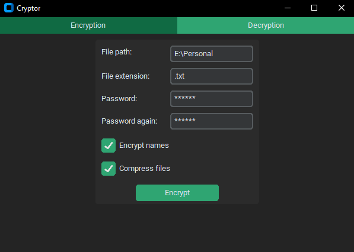
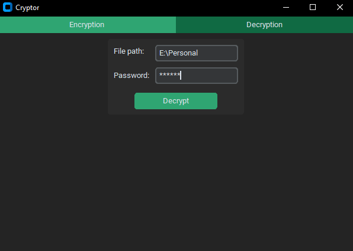

# Cryptor

## Description
Cryptor is a file encryption program that can encrypt either single files or entire directories and their subdirectories. It utilizes the popular and widely-used AES GCM encryption with a 128-bit key. The key is derived from a user-inputted password using the Argon2 KDF. Additionally, the user can choose to encrypt only certain file extensions or file/directory names and can select whether to compress the selected files. The application also features a user-friendly interface.

The encryption view.

The decryption view.

## Installation
Make sure you have the latest version of pip installed. The Python version used for this project is 3.12.2, though 3.10 has also been confirmed to work. This program has only been tested on Windows 10.

1. Clone the repo to your desired directory with:

`git clone https://github.com/Ilmo-P/Cryptor.git`

2. Using Pip install the requirements:

`pip install -r requirements.txt`

3. Start the application by running **main.pyw**

## Disclaimer
I am by no means a cybersecurity or software development expert, so the program may have bugs and issues. For safety reasons, I do not recommend using this program on any important files. Always double-check the path of the files you are about to encrypt.
